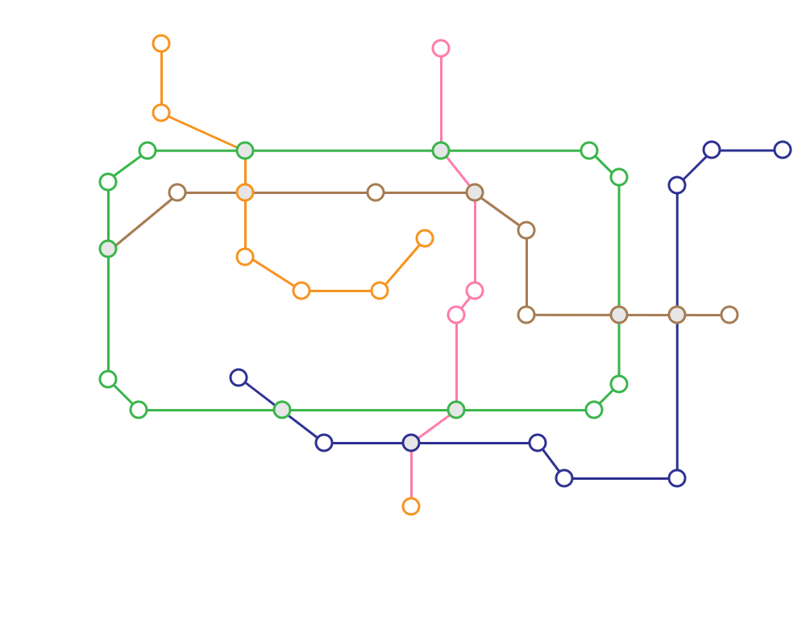

# kns2026-00002 Module C (4h)

## 1. 요구사항

### 가. 과제 요약

- 개발자인 당신은 클라이언트의 요구사항에 맞춰 다음의 페이지를 완성해야 한다.

- “투어 in 서울” 플랫폼은 서울 투어를 위해 필요한 버스 노선도와 주요 관광명소를 확인할 수 있는 페이지를 제공하고, 투어 일정을 등록할 수 기능이 포함되어야 한다.

- 고객이 등록된 투어 코스를 확인하고 예약할 수 있는 투어예약 페이지를 구현해야 한다.

- 신규 행사를 등록할 수 있는 행사등록 페이지를 구현하고 추가된 행사는 달력에 표기할 수 있어야 한다.

### 나. 공통사항

- 완성된 페이지는 Google Chrome에서 모든 기능이 정상적으로 동작하여야 하며, Google Chrome 및 Google Chrome 개발자 도구를 활용하여 평가될 것이다.

- 선수는 MySQL, PHP, JavaScript Library 등을 활용하여 페이지를 완성하고 필요한 경우 제공된 Bootstrap 등을 활용하여 UI를 구성할 수 있다.

- 과제 수행에 필요한 HTML코드와 CSS코드를 직접 작성하고, 필요시 B-Module에서 작성한 소스 코드를 수정할 수 있으며, 구현되는 모든 요소는 메인페이지 디자인과의 일관성을 유지해야 한다.

- 선수 본인이 데이터베이스를 설계 및 구축한다.

  - 관리자는 아이디(admin), 비밀번호(1234)으로 하여 선수가 미리 DB에 등록한다.

  - 일반회원은 회원가입을 통해 선수가 직접 등록한다.

- **API**

  - API의 구현은 각각의 예제로 나타낸 사양을 정확히 준수해서 이루어져야 한다.

  - url의 자리 표시자는 중괄호이다 (예: `/api/users/{id}`)

  - 응답의 Content-Type 헤더는 항상 `application/json`이다.

※ API 응답 확인은 Postman(포스트맨)을 활용한다.

### 다. 기능구현

#### ■ 회원가입

- 헤더의 [회원가입] 버튼 또는 링크를 클릭하여 나타난 모달을 통해 회원가입을 진행한다.

- 아이디는 4자 이상이어야 하며, 기존 회원과 중복될 수 없다.

- 비밀번호는 영문과 숫자 조합으로 5자 이상이어야 한다.

- 아이디, 비밀번호, 이름은 모두 필수 입력값이다.

- [가입] 버튼을 클릭하면 “회원가입이 완료되었습니다.”라는 메시지가 보이고 회원가입이 완료된다.

- 위 조건을 갖추지 못한 경우 적절한 메시지를 보여주며 등록이 거부되고 기존에 입력 중인 값은 유지되어야 한다.

#### ■ 로그인

- 헤더의 [로그인] 버튼 또는 링크를 클릭하여 나타난 모달을 통해 로그인을 진행한다.

- 아이디 또는 비밀번호가 일치하지 않는 경우 “아이디 또는 비밀번호를 확인해 주세요.” 라는 메시지를 보여주며 로그인이 거부되고 기존에 입력한 값은 유지되어야 한다.

- 로그인에 성공하면 헤더의 [로그인] 버튼 또는 링크는 [로그아웃] 버튼 또는 링크로 변경되고, [회원가입] 버튼 또는 링크는 사라진다.

- 로그아웃을 하면 [로그아웃] 버튼 또는 링크는 [로그인] 버튼 또는 링크로 변경되고, [회원가입] 버튼 또는 링크가 다시 나타난다.

#### ■ 투어 만들기 페이지

##### ○ 공통

- 투어 만들기 페이지는 관리자 외에는 접근할 수 없다.

- 투어 만들기 페이지는 투어코스 생성 페이지와 투어일정 설정 페이지로 구분되어 있다.

##### ○ 투어코스 생성 페이지

- 투어코스 생성 페이지는 서울시에서 제공하는 “투어 in 서울” 셔틀버스 노선 정보를 이용하여 최단 거리, 최소환승 노선을 알 수 있도록 한다.

- 투어 노선 정보는 “C\_Module/asset/” 폴더에 제공된 station.json 파일을 참고한다.

- 투어코스 생성 페이지는 노선도, 투어 코스 탭 메뉴(최단거리, 최소환승), 코스 목록, 일정설정 버튼으로 구성된다.

**셔틀버스 노선 정보**

| 필드 | 설명 |
| --- | --- |
| idx | 연번 |
| name | 경유지명 |
| coordinates | 경유지의 좌표 |
| route.key | 노선 |
| route.value | 연결된 경유지의 idx |

[station.json]

- 지도에는 “C\_Module/asset/” 폴더에 제공된 ‘map.png’ 파일을 활용하여 “투어 in 서울” 셔틀버스 노선도를 나타낸다.



[map.png – 1100 x 700]

- 경유지는 서울의 대표적인 관광, 문화 명소를 나타낸다.

- 노선도 위의 경유지에는 각각의 경유지명이 적절한 위치에 나타나도록 한다.

- 노선도 위의 경유지를 클릭하면 적절한 위치에 [출발지/도착지] 버튼이 팝업으로 나타난다.

- [출발지] 버튼을 클릭하면 해당 명소가 ‘출발지’로 설정된다.

- [도착지] 버튼을 클릭하면 해당 명소가 ‘도착지’로 설정된다.

- 선택된 출발지와 도착지는 노선도 위에서 구분되도록 표현되어야 한다.

- 하나의 경유지는 출발지이면서 동시에 도착지일 수 없다. (동시 설정 불가능)

- 출발지와 도착지가 설정되면 코스리스트에는 최단거리 또는 최소환승으로 계산된 코스 5개가 리스트 형태로 보여진다.

- 코스리스트의 개별 목록에는 진행경로(A → i → d → E의 형태), 거리, 환승 수가 포함되어야 한다.

- 코스 탭 메뉴에서 최단거리를 선택하면 코스리스트는 거리 기준 오름차순으로 정렬된다.

- 코스 탭 메뉴에서 최소환승을 선택하면 코스리스트는 환승 수 기준 오름차순으로 정렬된다. (단, 환승 수가 같은 경우 내에서는 거리 기준 오름차순으로 정렬한다.)

- 코스리스트의 목록을 클릭하면 해당 목록이 하이라이트 처리되고, 해당 목록의 진행경로와 경유지를 지도에 표시하여 보여준다.

- 선택된 코스의 경유지는 출발지와 도착지, 일반역, 환승역을 구분되도록 표현하여야 한다.

- 코스리스트에서 선택(하이라이트) 되어있는 코스가 없을 때, [일정설정] 버튼을 클릭하면 ‘선택된 투어 코스가 없습니다.’라는 메시지를 보이고 페이지 전환이 거부된다.

- 코스를 선택한 후 [일정설정] 버튼을 클릭하면 투어일정 설정 페이지로 부드럽게 슬라이드 되어야 하고, 투어코스 생성 페이지의 url에서 투어일정 설정 페이지의 url로 변경되어야 한다.

##### ○ 투어일정 설정 페이지

- 투어일정 설정 페이지에는 코스변경 버튼, 월간 달력, 이전 및 다음 버튼, 투어일정 등록 버튼이 존재한다.

- 월간 달력은 당월 및 익월을 기준으로 두 달이 함께 보여진다. (예 : 4-5월, 5-6월)

- 월간 달력의 [이전/다음] 버튼을 클릭하면 이전/다음 달의 달력을 볼 수 있다

- 일정 설정은 아래의 규칙을 따른다.

  1. 투어 등록은 익일부터 선택할 수 있고, 당일을 포함한 이전의 날짜들은 비활성화되어 선택할 수 없다. 이때, 비활성화된 날짜들은 그렇지 않은 날짜들과 구분 지어 표시되도록 한다.

  2. 출발지로부터 경유지를 포함한 도착지까지 이어지는 전체 투어 일정의 순서는 변경될 수 없다.

  3. 투어 일정은 출발지로 선택된 날짜로부터 연속적으로 등록하여야 한다. 첫 일정 이전날짜, 이전 일정에서 연이어지지 않은 날짜를 선택하면 “투어 순서상 적합한 위치가 아닙니다” 메시지를 보여주고 설정이 거부된다.

  4. 하루 최대 등록 가능한 투어 일정은 4개를 초과할 수 없으며, 초과하여 등록 시도할 경우 초과된 투어 일정은 전체 투어 순서에 따라 다음날로 이연되어 등록된다.

  5. 전체 투어 일정은 출발지를 드래그 앤 드롭하여 변경할 수 있어야 하고, 이동된 전체 투어 일정은 기존에 등록된 구성으로 유지되어야 한다.

  6. 출발지가 등록된 이후, 경유지와 도착지는 드래그 앤 드롭을 통해 일정을 변경할 수 있어야 한다. 이 때, 위에서 제시된 2~4항의 조건을 충족하여야 한다.

  7. 전체 일정은 여러 달에 걸쳐 등록될 수 있으며, 달력을 통해 확인 가능하여야 한다.

  8. 일정 설정 규칙에 대해서는 참고영상 폴더의 ‘tour.mp4’영상을 참고한다.

- [투어일정등록] 버튼을 클릭 시 투어명, 투어인원 상한, 투어금액 입력필드 및 등록 버튼을 포함하는 일정 설정 폼이 모달 창을 통해 보여진다.

- 일정 설정 폼의 모든 입력 필드는 필수 입력값이며, 누락된 필드가 있는 경우 적절한 메시지를 보여주고 투어 등록이 거부되어야 한다.

- 이동 일정을 전부 배치하지 않으면 ‘이동 일정이 모두 배치되지 않았습니다’ 메시지를 보여주고 투어 등록이 거부되어야 한다.

- 일정 설정 도중에 [코스변경] 버튼을 클릭하면 투어코스 생성 페이지로 부드럽게 슬라이드 되어야 하고, 투어일정 설정 페이지의 url에서 투어코스 생성 페이지의 url로 변경되어야 한다.

- 전환된 투어코스 생성 페이지에는 투어일정 설정 페이지로 접근하기 전에 생성했던 코스리스트와 선택한 코스, 지도상의 경로가 선택(하이라이트)된 상태로 유지되어 있어야 한다.

- 코스를 변경한 뒤에 투어일정 설정 페이지로 다시 접근하는 경우 달력 및 일정 설정 폼은 초기화 되어있어야 한다. 단, 코스를 변경하지 않고 투어일정 설정 페이지로 되돌아가는 경우 기존에 설정 중인 일정 설정 폼에 입력된 값과 달력이 유지되어 있어야 한다.

- 투어코스 생성 페이지와 투어일정 설정 페이지 간의 이동은 브라우저의 이전 페이지 버튼, 다음 페이지 버튼을 누를 때에도 [일정설정] 버튼과 [코스변경] 버튼을 클릭할 때와 동일한 동작으로 부드럽게 슬라이드 되어야 한다.

- 투어일정 등록을 하면 해당 투어에 대한 투어 idx 번호가 발급된다.

#### ■ 투어예약 페이지

- 투어예약 페이지는 등록된 투어를 시작날짜 기준으로 내림차순하여 리스트 형태로 보여준다.

- 리스트의 각 목록에는 투어명, 투어코스, 시작날짜, 종료날짜, 금액, 예약하기 버튼이 포함되어야 한다.

- 당일 기준으로 시작날짜가 되지 않았으면 ‘예약하기’ 버튼이 활성화되어 보여진다.

- 당일 기준으로 종료날짜가 지났으면 종료된 투어로 한다.

- 종료된 투어는 ‘종료된 투어입니다’라는 문구를 표시하고, 사용자가 직관적으로 해당 투어의 비활성 여부를 확인할 수 있도록 나타내야 한다.

- 진행중 투어, 종료된 투어, 해당 사용자가 이미 예약한 투어는 [예약하기] 버튼이 보이지 않아야 한다.

- 페이지에는 [종료된 투어 숨기기] 버튼이 존재하며, 클릭하면 [종료된 투어 보이기] 버튼으로 바뀌고, 종료된 투어가 리스트에서 사라진다.

- [종료된 투어 보이기] 버튼을 클릭하면 [종료된 투어 숨기기] 버튼으로 바뀌고 종료된 투어가 다시 리스트에 나타난다.

- [예약하기] 버튼을 클릭하면 예약을 할 수 있는 예약 모달 창이 나타난다.

- 예약 모달 창에는 예약인원 수를 입력할 수 있는 입력 필드와 남은 인원수, 금액이 계산되는 필드, 예약 버튼이 존재한다.

- 입력한 예약 인원수에 따라 남은 인원수와 금액이 자동으로 계산되어 실시간으로 변경된다.

- 입력한 예약 인원수가 투어의 남은 인원수를 초과하는 경우 [예약] 버튼이 비활성화 된다.

- [예약] 버튼을 클릭하면 ‘예약이 완료되었습니다’ 메시지를 보여주고 투어가 예약된다.

#### ■ 행사 등록 페이지

- 행사 등록 페이지는 행사를 등록할 수 있는 페이지로 관리자만 접근할 수 있어야 한다.

- 행사 등록 페이지에는 [행사명, 행사 시작일, 행사 종료일, 행사 시간, 행사 장소, 행사 분류, 주최기관, 대표 이미지]를 입력할 수 있는 필드와 추가 버튼이 존재하고 모든 입력 필드는 필수 입력값이다.

- 행사 종류는 [축제&행사, 전시&공연]로 구분되어 있으며, 이중 하나를 선택할 수 있어야 한다.

- 행사 기간은 시작일과 종료일을 입력할 수 있고, 시작일은 현재일 기준 다음날 부터 설정이 가능하여야 하며, 종료일은 시작일 이후로만 설정할 수 있다.

- 행사 이미지는 확장자가 jpg, jpeg, png인 파일 1개만 등록 가능하여야 한다.

- 모든 필드를 입력하고 [행사 추가] 버튼을 클릭하면 행사가 데이터베이스에 정상적으로 등록되어야 한다.

- 추가된 행사와 및 기존 행사는 메인페이지 투어 안내 영역의 달력과 3개 탭에 정상적으로 보여야 한다.

#### ■ 메인페이지 투어 안내 영역

- B 모듈에서 제작한 투어 안내 영역을 활용하여 제작하며 초기화면은 3개의 탭 중 전체를 기준으로 보여주어야 한다.

- 탭메뉴의 목록은 행사 시작일을 기준으로 오름차순 정렬되어 보여져야 한다.

- 행사가 있는 날은 달력에 행사의 존재 여부를 알 수 있도록 표시하여야 한다.

- 3개의 탭[전체, 축제&행사, 전시&공연] 중 하나를 선택하면 선택한 탭에 해당하는 행사(현재 선택된 달 기준)의 행사명과 행사기간(행사 시작일 ~ 행사 종료일)을 전부 보여주어야 한다.

- [이전달] 및 [다음달]을 클릭하면, 사용자가 선택한 탭이 유지되어 해당 변경되는 월의 행사명과 기간을 보여주어야 한다.

- 탭에서 전체를 선택하면 해당 행사가 [축제&행사] 인지, [전시&공연] 인지 여부를 구분할 수 있도록 표현되어야 한다.

- 행사명을 클릭하면 팝업으로 해당 행사의 상세 정보를 보여주어야 한다.

- 축제 상세 정보는 [행사명, 행사 시작일, 행사 종료일, 행사 시간, 행사 장소, 행사 분류, 주최기관, 대표 이미지]를 확인할 수 있어야 한다.

- 팝업의 [닫기] 버튼을 클릭하면 팝업이 사라진다.

- “투어 in 서울” 행사 정보는 “C\_Module/asset/” 폴더에 제공된 seoul\_tour.json 파일을 활용하여 데이터베이스에 행사 정보를 등록하여 활용한다.

**서울투어 정보**

| 필드 | 설명 |
| --- | --- |
| ID | 순번 |
| TITLE | 축제명 |
| CATEGORY | 분류 |
| STARTDATE | 행사 시작일 |
| ENDDATE | 행사 종료일 |
| TIME | 행사시간 |
| PLACE | 행사장소 |
| ORGANIZATION | 주최 |
| PHOTO | 대표 이미지 |

\[seoul_tour.json\]

#### ■ API 상세

**`GET /api/users/{user-id}/reservation`**

일반회원의 예약 내역을 조회한다. 시작날짜를 기준으로 오름차순으로 정렬해 반환되어야 한다.

Response `200` (#성공시)

```json
{
  "reservation": [
    {
      "name": "twotour",
      "course": "서울타워 → 국립극장",
      "start_date": "2026-09-15",
      "end_date": "2026-09-16",
      "number": 10,
      "charge": 100000
    },
    {
      "name": "contour",
      "course": "신촌 → 서울역 → 명동",
      "start_date": "2026-09-05",
      "end_date": "2026-09-07",
      "number": 3,
      "charge": 4500000
    }
  ]
}
```

Response `404` (#유저 ID가 존재하지 않으면)

```json
{
  "error": "해당 ID는 존재하지 않습니다."
}
```

**`GET /api/tours`**

투어 내역을 조회한다. Response `200` (#성공하면 반환됨)

```json
{
  "tours": [
    {
      "tour_idx": 1,
      "name": "twotour",
      "course": "서울타워 → 국립극장",
      "start_date": "2026-09-15",
      "end_date": "2026-09-16",
      "complement": 100,
      "price": 10000
    },
    {
      "tour_idx": 2,
      "name": "contour",
      "course": "신촌 → 서울역 → 명동",
      "start_date": "2026-09-05",
      "end_date": "2026-09-07",
      "complement": 50,
      "price": 1500000
    }
  ]
}
```

**`POST /api/tours/{tour-idx}/modify`**

등록된 투어의 일부 필드(투어명, 투어인원상한, 투어금액)를 수정할 수 있다.

Request Header: `content-type: application/json`

Request Body

```json
{
  "modify": {
    "name": "threetour"
  }
}
```

Response `201` (#성공시)

```json
{
  "modified": true,
  "info": {
    "name": "twotour → threetour"
  }
}
```

Response `404` (#투어 idx가 존재하지 않으면)

```json
{
  "error": "해당 투어는 존재하지 않습니다."
}
```

## 2. 선수 유의사항

### ■ 기본 유의사항

- 선수는 작업을 시작하기 전에 제공받은 ‘선수제공파일’을 반드시 백업한 후 진행하여야 한다. 
(선수의 실수로 제공 파일을 수정하거나 삭제한 경우에도 다시 제공하지 않는다)

- 선수는 스스로 제출한 최종 결과물이 심사위원의 컴퓨터에서도 동일하게 동작할 수 있도록 보장해야 한다. 또한 심사위원 컴퓨터에서 경로 등의 문제로 정상 표시되지 않거나 작동에 이상이 있는 경우에도 이를 심사위원이 수정하지 않고 채점 기준에 따라 채점이 진행된다는 것에 유의한다.

### ■ 과제 제출방법

- 모든 작업 파일을 C\_Module 폴더에 저장해야 한다. 해당 폴더에는 선수가 작업한 내용이 웹 브라우저에서 정상적으로 동작하는 데 필요한 모든 리소스(폴더 및 각종 파일)을 포함하여 제출해야 한다.

- 선수는 XAMPP 구동과 관련된 모든 서비스(또는 프로세스)를 종료한 후, XAMPP 폴더 전체를 제출한다. 제출한 작품은 http://localhost/ 또는 http://127.0.0.1/ 에서 정상 동작해야 한다.
